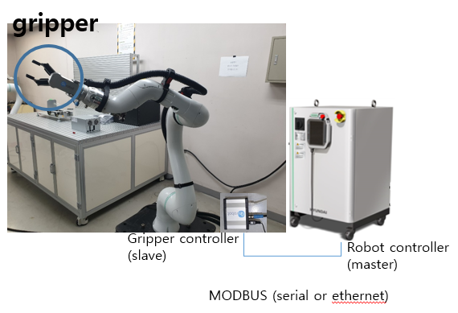
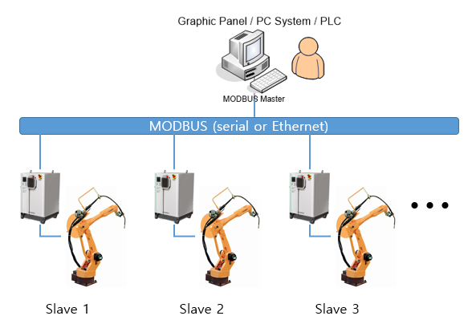
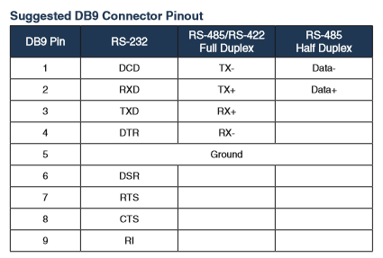

# 1.2 Functions of MODBUS

The Hi6 robot controller supports the MODBUS master and slave functions both through serial communication and Ethernet communication.

### <mark style="color:green;">1. Example of MODBUS master operation</mark>

*   **Control of equipment :**

    Capable of controlling the equipment (e.g., gripper) that supports MODBUS

### <mark style="color:green;">2. Example of MODBUS slave operation</mark>

*   **Function as an operation panel:**

    With an inexpensive graphic panel (GP) that supports MODBUS, you can use one or multiple robots by connecting them through serial or Ethernet communication.

*   **Programmable Logic Controller (PLC) communication:**

    Provides an inexpensive solution for communication with PLCs that have the MODBUS master function.

*   **PC-based robot operation system:**

    Allows a robot operation system to be built that monitors or controls the robot’s input and output signals using a PC.

.png>)

### <mark style="color:green;">3. Support method</mark>

| **Kind of operation** | **Serial communication** |          **Ethernet communication**         |
| :-------------------: | :----------------------: | :-----------------------------------------: |
|  Operation of master  | Robot language statement |           Robot language statement          |
|   Operation of slave  |   Setting in controller  | IP: Setting in controller Port: 502 (fixed) |

### <mark style="color:green;">4. Transmission mode</mark>

| **Kind of operation** |         **Serial communication**         | **Ethernet communication** |
| :-------------------: | :--------------------------------------: | :------------------------: |
|  Operation of master  |                binary mode               |         binary mode        |
|   Operation of slave  | 
ASCII mode

RTU(binary) mode
 |         binary mode        |

### <mark style="color:green;">5. Functions supported</mark>

| **Kind of operation** | 　　　　**Serial / Ethernet communication**                                                                                                                                                                                                                                                                                                                                                                      |
| :-------------------: | ------------------------------------------------------------------------------------------------------------------------------------------------------------------------------------------------------------------------------------------------------------------------------------------------------------------------------------------------------------------------------------------------------------ |
|  Operation of master  | <ul><li>03: read holding registers (multiple)</li><li>16: write holding registers (multiple)</li></ul>                                                                                                                                                                                                                                                                                                       |
|   Operation of slave  | <ul><li>01: read coils (bits)</li><li>02: read discrete inputs (bits)</li><li>03: read holding registers (multiple)                                                              </li><li>04: read input registers (multiple)</li><li>05: write single coil (bit)</li><li>06: write single holding register</li><li>15: write coils (multiple bits)</li><li>16: write holding registers (multiple)</li></ul> |

### <mark style="color:green;">6. Slave address</mark>

* Slave address: 1–247
* If the slave address of a command is 0, the broadcasting function, which allows all slaves to operate regardless of the set address, will be supported.

### <mark style="color:green;">7. Serial communication connection</mark>

* Connector (DSUB – 9pin: female)

.png>)

* Pin map

### <mark style="color:green;">8. Address map</mark>

.png>)

*   The enlarged numbers in italics in the table above represent the relay groups used in the MODBUS function.

    * MW(data memory for user)
    * DO(digital output)
    * SO(system output)
    * SI(system input)
    * SW(System memory)

*   Data format:

    For the float format, IEEE single-precision 32-bit float point is used, and, in the case of 8 bit / 16 bit / 32 bit, signed integers are used all.

*   <mark style="color:red;background-color:yellow;">\*For the relay's endian, little endian is used</mark>

    Example: In the case of dof0=6.515625(0x40D08000), which is in the float format

    dol0=0x40D08000 → dow0=0x8000, dow2=0x40D0 → dob0=0x00, dob1=0x80, dob2=0xD0, dob3=0x40


Explanation: In MODBUS transmission, big endian of 16-bit align is used.&#x20;

In other words, the transmission described above will be performed in the order of 0x80, 0x00, 0x40, and 0xD0.


### <mark style="color:green;">9. SW memory map</mark>&#x20;

.png>)

#### PLC-related

.png>)

#### Software version

.png>)

#### Program counter

.png>)

#### Total time of operation

.png>)

#### Robot position

.png>)

#### Robot speed

.png>)

#### Robot load factor

.png>)

#### Conveyor synchronization

.png>)
