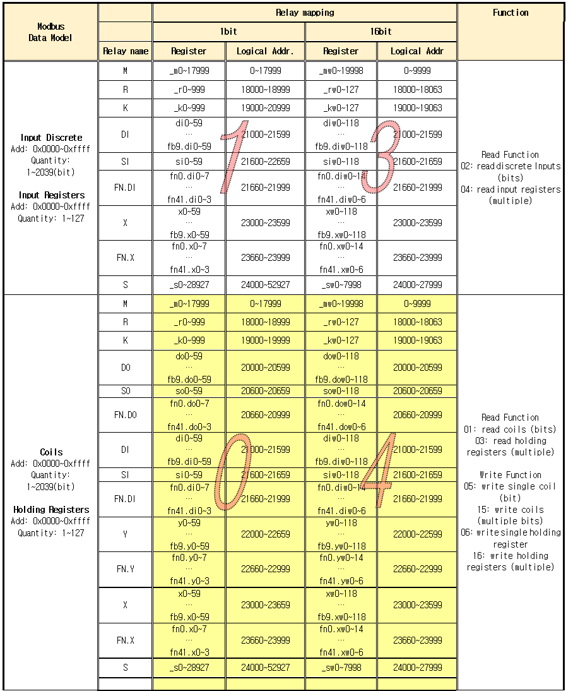

# 1.2 Modbus的功能

${cont_model} 机器人控制器通过串行和以太网通信支持Modbus主从功能。

### 1. Modbus主操作示例

*   **设备控制**

    使设备（例如夹具）的控制成为可能，该设备支持Modbus。

### 2. MODBUS从操作示例

*   **操作面板功能**

    可以通过支持Modbus的廉价图形面板（GP）通过串行或以太网通信连接和使用一个或多个机器人。

*   **PLC通信**

    通过廉价解决方案使与支持Modbus主功能的PLC进行通信成为可能。

*   **基于PC的机器人操作系统**

    您可以构建一个基于PC的机器人操作系统，以监控或控制机器人的输入/输出信号。

### 3. 支持方法

| **操作方法** | **串行通信** |   **以太网通信**   |
| :-------: | :--------: | :------------------------------------: |
| 主设备操作 | 
机器人语言命令  控制器设置  
 | 
机器人语言命令  控制器设置
               |
| 从设备操作|   控制器设置   | 
控制器设置

(可以添加3个端口)
 |

### 4. 传输模式

| **操作方法** |  **串行通信** | **以太网通信** |
| :-------: | :----------------------------------: | :--------: |
| 主设备操作 |               二进制模式              |  二进制模式 |
| 从设备操作 | 
ASCII模式

RTU（二进制）模式
 |  二进制模式 |

### 5. 支持的功能

| **操作方法** |   **串行/以太网通信**  |
| :-------: | :----------------------------------: |
| 主控制器的操作 | <ul><li>03：读取保持寄存器（多个）</li><li>16：写入保持寄存器（多个）</li><li>04：读取输入寄存器（多个）</li></ul> |
| 从设备的操作 | <ul><li>01：读取线圈（位）</li><li>02：读取离散输入（位）</li><li>03：读取保持寄存器（多个）</li><li>04：读取输入寄存器（多个）</li><li>05：写入单个线圈（位）</li><li>06：写入单个保持寄存器</li><li>15：写入线圈（多个位）</li><li>16：写入保持寄存器（多个）</li></ul> |

### 6. 从设备地址

* 从设备地址：1-247

 

### 7. 地址映射

*   上表中斜体的大数字字符是Modbus中使用的继电器组。

    * MW（用户数据存储）
    * DO（数字输出）
    * SO（系统输出）
    * SI（系统输入）
    * SW（系统内存）
    * Y（输出继电器）
    * X（输入继电器）

*   数据格式

    在浮点格式方面，使用IEEE单精度32位浮点数。对于8位/16位/32位，将使用所有有符号整数。

* 对于继电器的字节序，使用小端格式。

    例如：在浮点格式下，dof0=6.515625（0x40D08000）作为示例

    dol0=0x4D08000 -> dow0=0x8000, dow2=0x40D0 -> dob0=0x00, dob1=0x80, dob2=0xD0, dob3=0x40


对于Modbus传输，字节序将是16位对齐的大端格式。

换句话说，上述传输将以0x80, 0x00, 0x40和0xD0的顺序进行。


### 8. SW内存映射

* 这是系统内部定义的信息。有关更多详细信息，请参考《嵌入式PLC用户手册》。