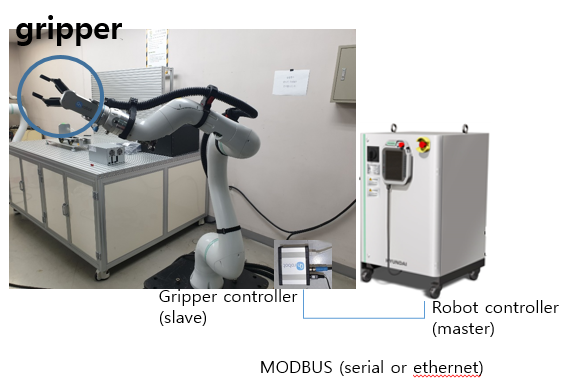
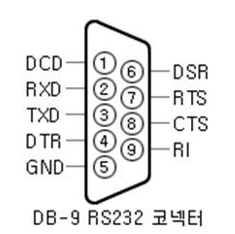

# 1.2 모드버스 기능

Hi6 로봇 제어기는 시리얼 통신과 이더넷 통신에 의한 Modbus 마스터, 슬레이브 기능을 모두 지원합니다.

### <mark style="color:green;">1. MODBUS master 운용 예</mark>

*   **장비 제어**

    MODBUS를 지원하는 장비(ex. Gripper)를 제어할 수 있습니다.

### <mark style="color:green;">2. MODBUS slave 운용 예</mark>

*   **조작반 기능**

    MODBUS 를 지원하는 저렴한 GP(Grahic Panel)로 한 대 혹은 여러 대의 로봇을 시리얼 또는 이더넷 통신으로 연결하여 사용할 수 있습니다.

*   **PLC 통신**

    MODBUS Master 기능을 갖는 PLC 들과의 통신을 저렴한 Solution 으로 제공합니다.

*   **PC 로봇운영 시스템**

    PC를 이용하여 로봇의 입출력 신호를 모니터링 하거나 제어하는 로봇 운영 시스템을 구축할 수 있습니다.

### <mark style="color:green;">3. 지원 방식</mark>

| **운영 방식** | **시리얼 통신** |               **이더넷 통신**               |
| :-------: | :--------: | :------------------------------------: |
| Master 운영 |  
로봇 언어 명령문

제어기 설정
 |                
로봇 언어 명령문

제어기 설정
               |
|  Slave 운영 |   제어기 설정   | 
IP: 제어기 설정

Port: 502, 5000, 5001(고정)
 |

### <mark style="color:green;">4. 전송 모드</mark>

| **운영 방식** |              **시리얼 통신**              | **이더넷 통신** |
| :-------: | :----------------------------------: | :--------: |
| Master 운영 |               binary 모드              |  binary 모드 |
|  Slave 운영 | 
ASCII 모드

RTU(binary) 모드
 |  binary 모드 |

### <mark style="color:green;">5. 지원 펑션</mark>

| **운영 방식** | 　　　　　　　　**시리얼 / 이더넷 통신**                                                                                                                                                                                                                                                                                                                                                                                     |
| :-------: | ------------------------------------------------------------------------------------------------------------------------------------------------------------------------------------------------------------------------------------------------------------------------------------------------------------------------------------------------------------------------------------------------------------ |
| Master 운영 | <ul><li>03: read holding registers (multiple)</li><li>16: write holding registers (multiple)</li></ul>                                                                                                                                                                                                                                                                                                       |
|  Slave 운영 | <ul><li>01: read coils (bits)</li><li>02: read discrete inputs (bits)</li><li>03: read holding registers (multiple)                                                              </li><li>04: read input registers (multiple)</li><li>05: write single coil (bit)</li><li>06: write single holding register</li><li>15: write coils (multiple bits)</li><li>16: write holding registers (multiple)</li></ul> |

### <mark style="color:green;">6. 슬레이브 주소</mark>

* 슬레이브 주소 : 1\~247
* 명령어의 슬레이브 주소가 0인 경우, 설정된 주소와 무관하게 모든 슬레이브가 동작하는 Broadcasting 기능을 지원합니다.

### <mark style="color:green;">7. 시리얼 통신 연결</mark>

* 커넥터 (DSUB - 9 pin : female)

* 핀맵

### <mark style="color:green;">8. Address 맵</mark>

*   상기 표의 기울임 꼴 큰 숫자는 Modbus 에서 사용하는 relay 그룹임

    * MW(data memory for user)
    * RW(auxiliary memory for user)
    * KW(keep memory for user)
    * DO(digital output)
    * SO(system output)
    * SI(system input)
    * SW(System memory)
    * Y(output relay)
    * X(input relay)

*   Data 형식

    Float 형식은 IEEE single-precision 32 bit float point를 사용하고, 8 bit/16 bit/32 bit 들은 전부 signed 정수를 사용함.

*   <mark style="color:red;background-color:yellow;">\*Relay 의 Endian 은 Little Endian 을 사용</mark>

    예, Float 형식인 dof0=6.515625(0x40D08000)인 경우

    dol0=0x4D08000 -> dow0=0x8000, dow2=0x40D0 -> dob0=0x00, dob1=0x80, dob2=0xD0, dob3=0x40


Modbus 전송은 16 bit align 의 Big Endian 임.

즉, 상기 전송은 0x80, 0x00, 0x40, 0xD0 의 순서로 전송됨.


### <mark style="color:green;">9. SW 메모리 맵</mark>&#x20;

<mark style="color:red;">\*시스템 내부적으로 정의된 정보로 이에 대한 세부 내용은 "내장 PLC 사용 설명서"를 참고하십시오.</mark>
