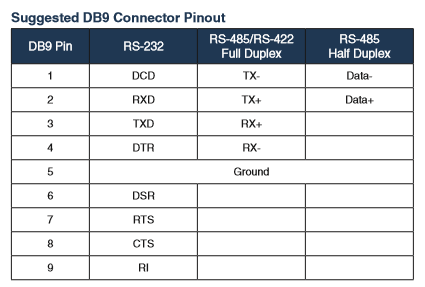

# 1.2 Functions of the Modbus

The Hi6 robot controller supports the Modbus master and slave functions via serial and Ethernet communications.

### <mark style="color:green;">1. Operational example of a Modbus master </mark>

*   **Equipment control**

    Enables control over the equipment (ex. gripper) that supports the Modbus.

### <mark style="color:green;">2. Operational example of a MODBUS slave</mark>

*   **Operation Panel Function**

    One or several robots can be connected and used through serial or Ethernet communications using an inexpensive grahic panel (GP) that supports the Modbus.

*   **PLC Communication**

    Enables communication with PLCs with the Modbus master function through inexpensive solutions.

*   **PC-Based Robot Operation System**

    You can build a PC-based robot operating system that monitors or controls the input/output signals of the robot.

### <mark style="color:green;">3. Support method</mark>

| **Operation method** | **Serial communication** |               **Ethernet communication**               |
| :-------: | :--------: | :------------------------------------: |
| Operation of a master |  
Statements in robot language

Settings of the controller  
 |                
Statements in robot language

Settings of the controller
               |
|  Operation of a slave|   Settings of the controller   | 
IP: Settings of the controller

Port: 502, 5000, 5001 (Fixed)
 |

### <mark style="color:green;">4. Transmission mode</mark>

| **Operation method** |              **Serial communication**              | **Ethernet commuication** |
| :-------: | :----------------------------------: | :--------: |
| Operation of a master |               binary mode              |  binary mode |
|  Operation of a slave | 
ASCII mode

RTU (binary) mode
 |  binary mode |

### <mark style="color:green;">5. Functions supported</mark>

| **Operation method** | 　　　　　　　　**Serial/Ethernet communication**                                                                                                                                                                                                                                                                                                                                                                                     |
| :-------: | ------------------------------------------------------------------------------------------------------------------------------------------------------------------------------------------------------------------------------------------------------------------------------------------------------------------------------------------------------------------------------------------------------------ |
| Operation of the master | <ul><li>03: read holding registers (multiple)</li><li>16: write holding registers (multiple)</li></ul>                                                                                                                                                                                                                                                                                                       |
|  Operation of a slave | <ul><li>01: read coils (bits)</li><li>02: read discrete inputs (bits)</li><li>03: read holding registers (multiple)                                                              </li><li>04: read input registers (multiple)</li><li>05: write single coil (bit)</li><li>06: write single holding register</li><li>15: write coils (multiple bits)</li><li>16: write holding registers (multiple)</li></ul> |

### <mark style="color:green;">6. Slave address</mark>

* Slave address: 1–247
* Supports the broadcast function that operates all slaves regardless of the set address if the slave address of the command is 0.

### <mark style="color:green;">7. Serial communication connection</mark>

* Connector (D-sub 9pin female)

* Pin map

### <mark style="color:green;">8. Address map</mark>

*   The large numeric characters in italics in the table above are relay groups used in the Modbus.

    * MW (data memory for user)
    * DO (digital output)
    * SO (system output)
    * SI (system input)
    * SW (System memory)
    * Y (output relay)
    * X (input relay)

*   Data format

    When it comes to the floating-point format, the IEEE single-precision 32 bit float-point is used. For 8 bit/16 bit/32 bit, all signed integers will be used.

*   <mark style="color:red;background-color:yellow;">\*For the endian of the relay, little-endian is used.</mark>

    Example: In the case of dof0=6.515625 (0x40D08000) in float format as an example

    dol0=0x4D08000 -> dow0=0x8000, dow2=0x40D0 -> dob0=0x00, dob1=0x80, dob2=0xD0, dob3=0x40


For Modbus transmissions, the endian will be 16-bit aligned big-endian.

In other words, the above transmission will occur in the order of 0x80, 0x00, 0x40, and 0xD0.


### <mark style="color:green;">9. SW memory map</mark>&#x20;

<mark style="color:red;">\*This is information defined internally by the system. For more details, refer to the "Embedded PLC User Manual."</mark>
