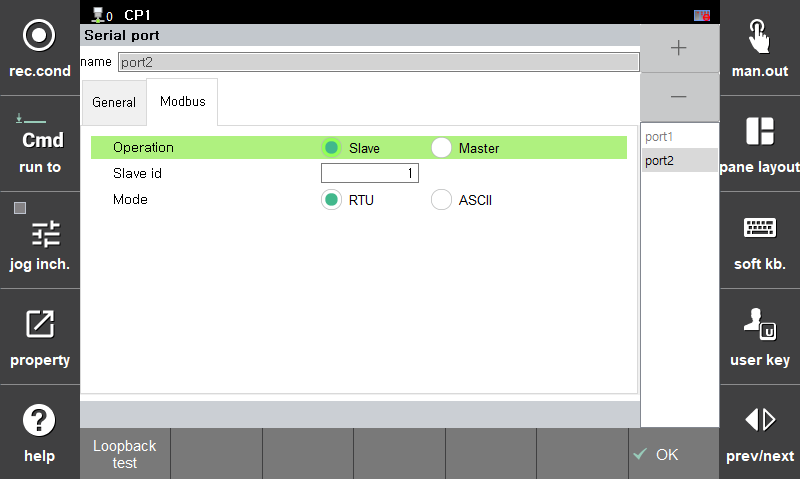

# 2.3 Modbus environment setting 

The details of the Modbus can be set in the **\[Modbus]** tab as follows.

*   **Operation**: Select whether to operate as the master or the slave.

    In cases of operations as the master, the slave ID and mode will not be used, as the execution will be performed by commands in robot language.  
    In cases of operations as the slave, the controller responds to master requests, so it operates only with the settings on the screen.   
* **Slave ID**: Set the ID for communications as the slave of the modbus serial communication.
* **Mode**: Set the mode for communications as the slave of the modbus serial communication.
