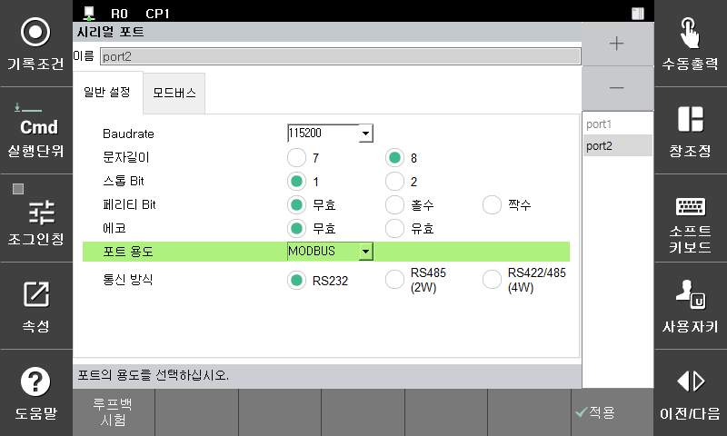

# 2.2 Setting the Serial Port Usage

You can set the usage of the serial port to the Modbus by applying the settings as follows in the **\[General Setting]** tab of the **\[Setting > 2: Control Parameter > 3: Serial Port]** screen.

