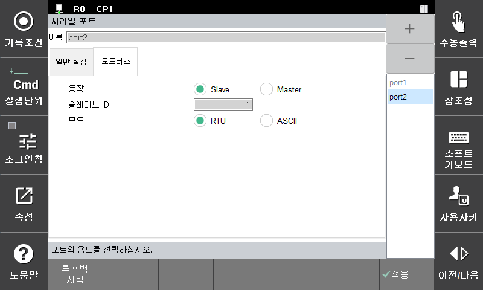

# 2.3 모드버스 환경 설정

모드버스의 세부사항은 **\[모드 버스]** 탭에서 다음과 같이 설정할 수 있습니다.

*   **동작**: Master 로 운영할지, Slave 운영할지 선택합니다.

    Master로 운영 시 로봇언어 명령어에 의해 수행되기 때문에 슬레이브 ID와 모드는 사용하지 않습니다.
* **슬레이브 ID**: 모드버스 시리얼의 Slave 로 통신하기 위한 ID 를 설정합니다.
* **모드**: 모드버스 시리얼의 Slave 로 통신하기 위한 mode를 설정합니다.
