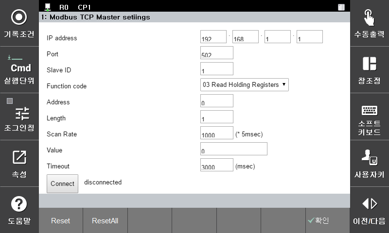

# 3.2.1 Setting the Modbus TCP Master

This setting is used for configuring a Modbus TCP master query and sending it to a slave.

Using the relevant master, you can perform communications.

You can set the Modbus TCP master in the **\[Setting > 2: Control parameter > Modbus > 1: Modbus TCP Master settings]** screen.


To communicate using the changed parameters, the changes should be reflected through [Confirm] or [Apply (shift + confirm)]. Doing so will enable you to perform a job correctly.


<li>IP address: Slave device IP address</li>
<li>Port: TCP communication port number (default value: 502)</li>
<li>Slave ID: Slave device ID</li>
<li>Function code: Function code (03: Read Holding Registers /16: Write Multiple registers)
<li>Address: Slave register start address</li>
<li>Length: Slave register length</li>
<li>Scan Rate: Communication cycle (unit: 5 msec)</li>
<li>Value: 03: Data value to be read/16: Data value to be written (example) 1 unit of data: 0 / 3 units of data: 0,1,2 </li>
<li>Timeout: Time out (unit: msec)</li>
<li>Connect: Connects and starts transmitting and receiving data</li>
<li>Reset: Initializes to the previously saved value of the selected parameter. For an & value (read), the value that was read should be updated</li>
<li>ResetAll: Initializes to the previously saved values of all parameters</li>

