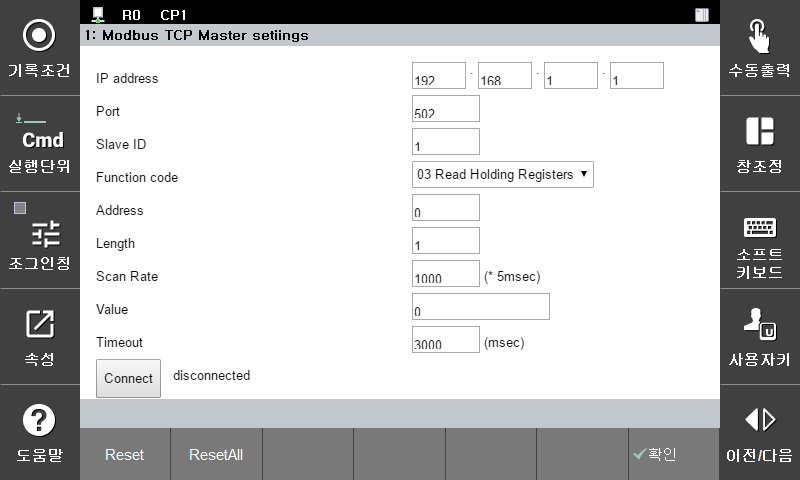

# 3.2.1 모드버스 TCP 마스터 설정

모드버스 TCP 마스터 쿼리를 구성하고 이를 슬레이브에 전송하는 설정입니다.

해당 마스터를 활용하여 통신을 수행할 수 있습니다.

모드버스 TCP 마스터를 설정하는 것은 **\[설정 > 2: 제어 파라미터 > Modbus > 1: Modbus TCP Master settings]** 화면에서 설정할 수 있습니다.


변경된 파라미터로 통신하기 위해서는 [확인] 혹은 [적용(shift + 확인)] 을 통해 변경 내용을 반영하신 뒤에 올바른 작업을 하실 수 있습니다.


<li>IP address: 슬레이브 장치 IP 주소</li>
<li>Port: TCP 통신 포트 번호 (기본값:502)</li>
<li>Salve ID: 슬레이브 장치 ID </li>
<li>Function code: 함수 코드 (03: Read Holding Registers /16: Write Multiple registers)
<li>Address: 슬레이브 레지스터 시작 주소</li>
<li>Length: 슬레이브 레지스터 길이</li>
<li>Scan Rate: 통신 주기 (단위: 5msec) </li>
<li>Value: 03: 읽어오는 데이터 값/16: 쓰여지는 데이터 값 (예) 1개 데이터: 0 / 3개 데이터 : 0,1,2 </li>
<li>Timeout: 타임 아웃 (단위:msec) </li>
<li>Connect: 연결 및 데이터 송수신 시작</li>
<li>Reset: 선택된 파라미터의 이전 저장 값으로 초기화 & value(read)의 경우, 읽어 온 값 갱신 </li>
<li>ResetAll: 모든 파라미터들의 이전 저장 값으로 초기화</li>

