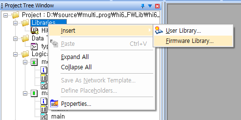
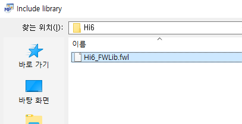
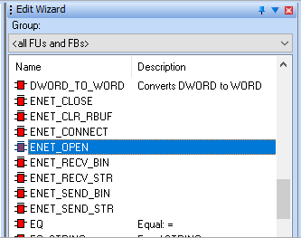
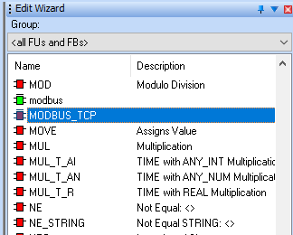

# 3.2.1 Native firmware library 추가

하기의 그림과 같이 **\[Libraies > Firmware Libray…]** 에서 “**Hi6\_FWLib.fwl**” 파일을 선택하여 추가합니다.

 

Edit Wizard 에서 ENET 통신과 관련된 펑션 블록들과 MODBUS\_TCP 와 관련된 펑션 블록이 추가된 것을 확인할 수 있습니다.

 
