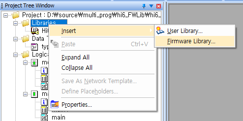
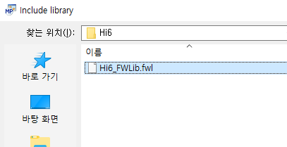
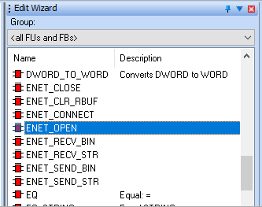
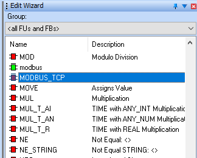

# 3.2.1 Addition of native firmware library

In **\[Libraries > Insert > Firmware Library...]**, select the “**Hi6\_FWLib.fwl**” file, and add it, as shown below.

 

In the Edit Wizard, you can see that the function blocks related to ENET communication and those related to MODBUS\_TCP have been added.

 
