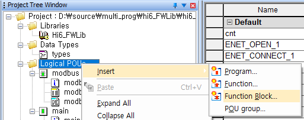
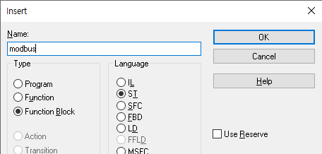

# 3.2.2 Addition of function blocks

In **\[Logical POUs > Insert > Function Block...]**, as shown in the figure below, you can add a function block.

In this example, we have chosen to use the ST language under Modbus.

