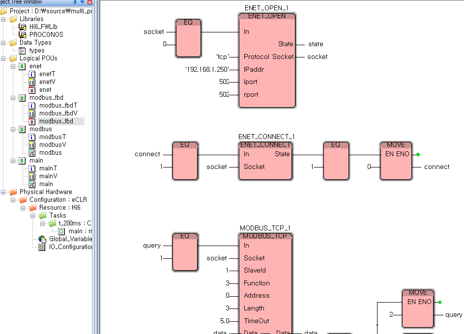
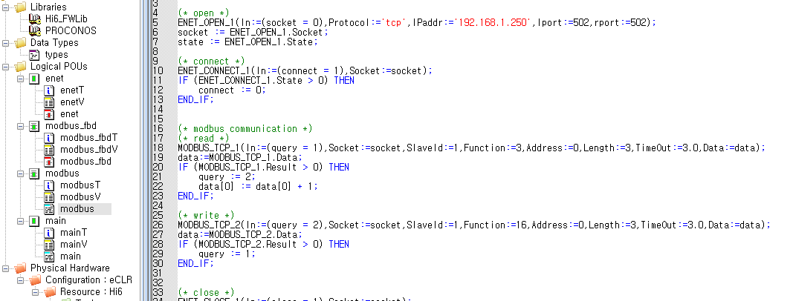

# 3.2.4 Creation of function blocks

As shown in the following figure, the user can write a program on the program writing screen.

#### <mark style="color:green;">FBD language</mark>

#### <mark style="color:green;">ST language</mark>

