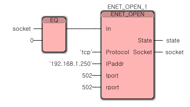
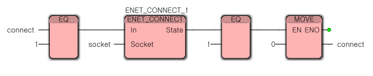
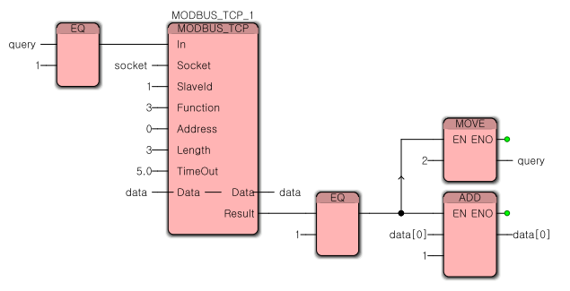
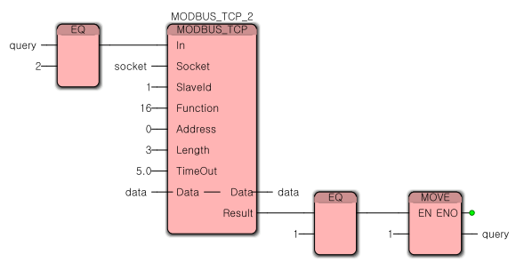
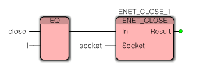

# 3.2.6 샘플 펑션 블록 설명

* PLC 를 RUN 하면 socket 변수가 0 으로 초기화 되어 있어 enet 통신을 위한 소켓을 자동으로 open 합니다.
* IPaddr 은 연결할 상대 장치의 ip address 를 지정합니다.

* connect 변수를 1 로 설정하면 슬레이브 장치와 연결 동작을 수행한 후 connect 변수를 0 으로 변경합니다.

* query 변수를 1 로 설정하면 Function:=3, Address:=0, Length:=3 에 의해 슬레이브에서 0 번지부터 3 개의 데이터를 얻어와 data의 배열 변수로 전달합니다. (read)
* Result 가 1 이면 query 를 2 로 설정하고 data\[0]의 변수 값을 1 증가 합니다.

* query 변수가 2 이면  Function:=16, Address:=0, Length:=3 에 의해 data 배열 변수에 설정된 값을 슬레이브의 0 번지부터 3 개의 데이러를 설정합니다. (write)
* Result가 1 이면 query 를 1 로 설정합니다.

* close 변수를 1 로 설정하면 소켓을 닫게 됩니다.

