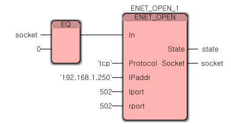
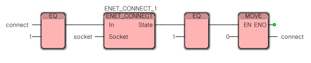
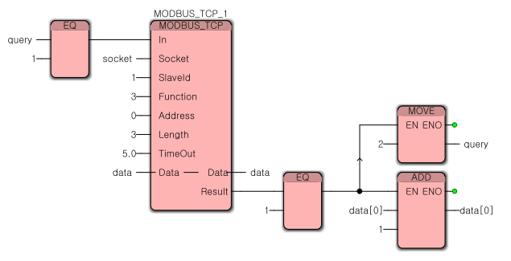
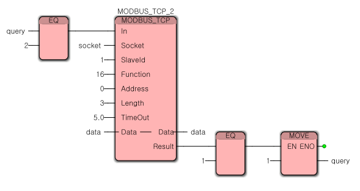
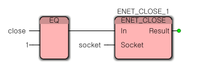

# 3.2.6 Description of sample function blocks

* Once the PLC is run, the socket for ENET communication will be automatically opened because the socket variable has been already initialized to “0.”
* Regarding IPaddr, you must designate the IP address of the counterpart device that you need to connect to.

* In case the connect variable is set to “1,” the operation of connection to the slave device will be performed, and then the connect variable will be changed to “0.”

* In case the query variable is set to “1,” 3 data results will be obtained from the address 0 of the slave in compliance with Function:=3, Address:=0, and Length:=3 and then transferred to the array variable of data (read).
* In case the result is “1,” the query will be set to “2,” and the variable value of data\[0] will be increased by 1.

* In case the query variable is set to “2,” the value set in the data array variable will be set as the 3 data to the address 0 of the slave in compliance with Function:=16, Address:=0, and Length:=3 (write).
* In case the result is “1,” the query will be set to “1.”

* In case the close variable is set to “1,” the socket will be closed.

