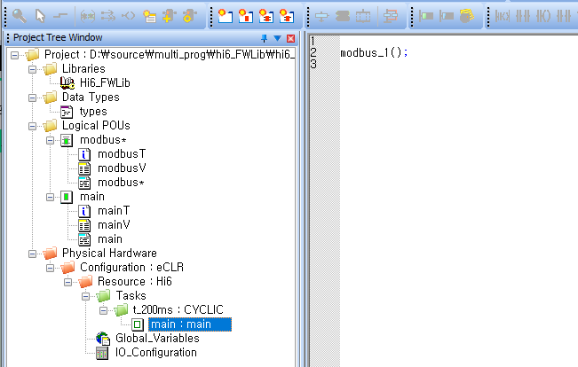

# 3.2.7 Operation of sample function blocks

* The function blocks written as samples will be called and executed from main, which is a program POU.
* Main, a program POU, will be executed every 200 ms in the Cycle task.

