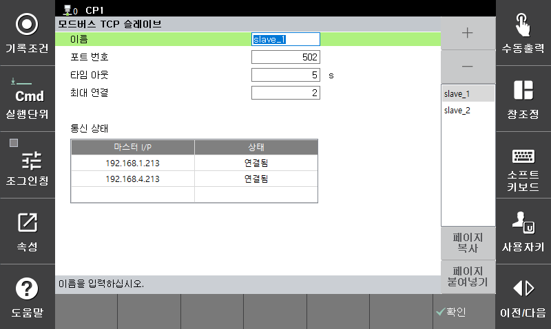

# 3.2 Modbus slave setting

Set on the `[F2: System] - 2: Control parameter - 9: Network - 2: Service - 1: Modbus slave` screen.  
Up to three slaves can be used using "+" button, and the current communication status can also be monitored.  
When operating as a slave, the controller responds to master requests, so it operates only with the settings on the screen.  

*   **Port No.**

    Sets the port for MODBUS TCP communication.  
    Each slave must be set to a different port number.

*   **Timeout**

    Sets the time to check the MODBUS TCP communication connection status.  
    If there is no service request from the master for a specified period of time, the connection is forcibly terminated.

*   **Max connection**

    Sets the maximum number of connections for the master that can be connected to each slave.  
    Currently, you can get up to three.
