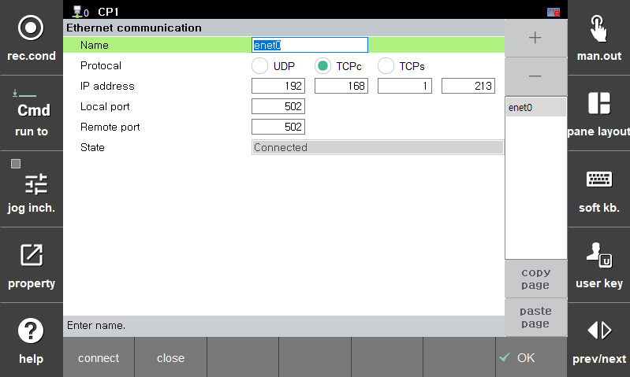

# 3.3 以太网通信设置

在进行 Modbus TCP 主操作之前，您必须首先创建并配置以太网通信对象。 

在 `[F2: 系统] - 2: 控制参数 - 9: 9：网络 - 2: 服务 - 4: 以太网通信 ([F2: System] - 2: Control parameter - 9: Network - 2: Service - 4: Ethernet communication)` 屏幕上设置。 
最多可以使用 "+" 按钮创建五个以太网对象，并可进行使用，同时也可以监控当前的通信状态。 
由于主设备使用机器人语言命令操作，因此您必须单独编写并运行任务程序，而不是通过屏幕设置。 （请参阅 [3.4 Modbus 主操作]） 

您可以使用 `[Close]` 按钮强制关闭相应以太网对象的套接字，并使用 `[Connect]` 按钮进行通信连接。 
当控制器启动时，它会自动与配置的以太网对象建立通信连接。 

*   **名称**

    以太网通信对象的名称。每个名称必须设置为 "enet0" ~ "enet4"。

*   **协议**

    选择通信协议。对于 MODBUS TCP 主操作，必须设置为 "TCPc"（TCP 客户端）。

*   **IP 地址**

    设置从设备使用的 IP 地址。

*   **本地端口**

    设置本地端口号。Modbus 通信默认使用端口 502。

*   **远程端口**

    设置远程端口号。Modbus 通信默认使用端口 502。

*   **状态**

    显示通信连接的状态。