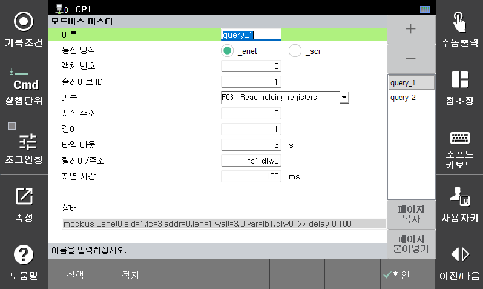
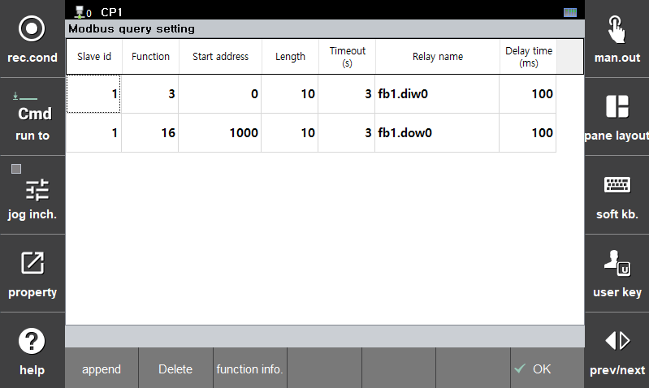

# 4.2 쿼리설정으로 동작

사용자가 모드버스 마스터 쿼리를 설정하면 이를 기반으로 자동으로 슬레이브에 전송할 수 있습니다.  
구성된 쿼리에서 해당 쿼리를 실행할 때 데이터 송수신이 이루어집니다.  
 

**\[시스템 > 2: 제어 파라미터 > 9: 네트워크 > 2: 서비스 > 5: 모드버스 마스터]** 화면에서 설정합니다.  
"+"버튼을 사용하여 마스터를 추가할 수 있습니다.  

[정지] 버튼으로 마스터 실행을 강제로 정지할 수 있으며 [실행] 버튼으로 다시 실행할 수 있습니다.  
[쿼리 설정] 버튼으로 쿼리를 구성할 수 있습니다.  
제어기 부팅후에는 설정된 쿼리가 순차적으로 자동으로 실행됩니다.  

*   **이름**

    마스터 객체의 이름입니다. 각각의 이름은 반드시 "master_?"로 설정되어야 합니다.

*   **통신 방식**

    해당 마스터의 통신 방식을 선택합니다. (이더넷 또는 시리얼)

*   **객체 번호**

    이더넷 통신의 경우 [3.3 이더넷 통신](../3-modbus-tcp/3-enet-comm-setting.md)에 설정된 enet 번호를 설정합니다.   
    시리얼 통신의 경우는 현재 2만 사용이 가능합니다. 

*   **상태**

    동작중 쿼리의 실행 상태를 로봇언어 명령어로 구성하여 표시합니다. 동작이 정지된 경우에는 "Stopped"를 표시합니다. 

*   **쿼리 설정 상태**

    해당 마스터에 구성된 쿼리의 설정 상태를 표시합니다. 
 
 

[추가] 버튼으로 새로운 쿼리를 추가할 수 있으며 [삭제하기] 버튼으로 해당 쿼리를 삭제할 수 있습니다.  

*   **슬레이브 ID**

    슬레이브 ID(1~247)를 설정합니다.

*   **펑션**

    펑션코드를 설정합니다. [펑션 정보] 버튼으로 지원하는 펑션들을 확인할 수 있습니다.  

*   **시작 주소**

    슬레이브의 시작주소(0~65534)를 설정합니다. 

*   **길이**

    데이터 개수(words : 1~127, bits : 1~2000)를 설정합니다. 

*   **타임 아웃**

    타임아웃 시간(sec)을 설정합니다. 0으로 설정하면 무한대기 합니다. 

*   **릴레이 이름**

    릴레이(데이터 메모리/입출력신호 등) 명칭으로 설정합니다. 

*   **지연 시간**

    해당 쿼리가 실행된 후 다음 쿼리가 실행하기까지의 지연시간(ms)을 설정합니다. 

